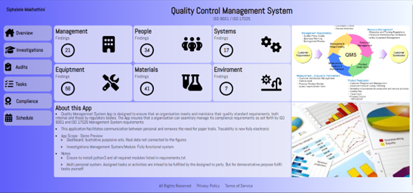

# QUALITY MANAGEMENT SYSTEM

## Overview
Quality Managemnet System App is designed to ensure that an organisation meets and maintains their quality standard requirements, both internal and those by regulatory bodies. The App insures that a organisation can seamlisly manage its complience requirements as set forth by ISO 9001 and ISO 17025 Management System requirements

This application facilitates communication between personal and removes the need for paper trails. Tracability is now fully electronic

## App Scope
### Scope - Limited / Demo Preview
* Login and Signup: User can create a username and password to login
* Dashboard: Ilustrative purposive only. Real data not connected to the numerical figures seen on the dashboard
* Side panel navigation: Only "Overview" & "Investigations" have their routes included in this demo
* Investigations: This is a complete system, which demonstrates the handing of improvement and investigations.
* Server folder conatains database.db file used by the app. If the file is not present it will be created on app startup
* Server/files: This folder stored uploaded files in the format f"{uuid4}"_secure_filename
* App is designed for multi personal usage, however in this demo the user can create and complete investigations themselves. Deployed version allocates users tasks and activities and by assignment

## Requirment
* python3
* Flask
* flask-cors
* flask_dance
* flask_login
* flask_wtf
* SQLAlchemy
* jinja2
* werkzeug

## Instructions
1. Clone the repository into your folder
2. Install the required packages listed above
2. Run the app python3 app.py
3. On your browser go to http://127.0.0.1:5000
4. Sign-Up to Login - Navigate to Investigations Menu
